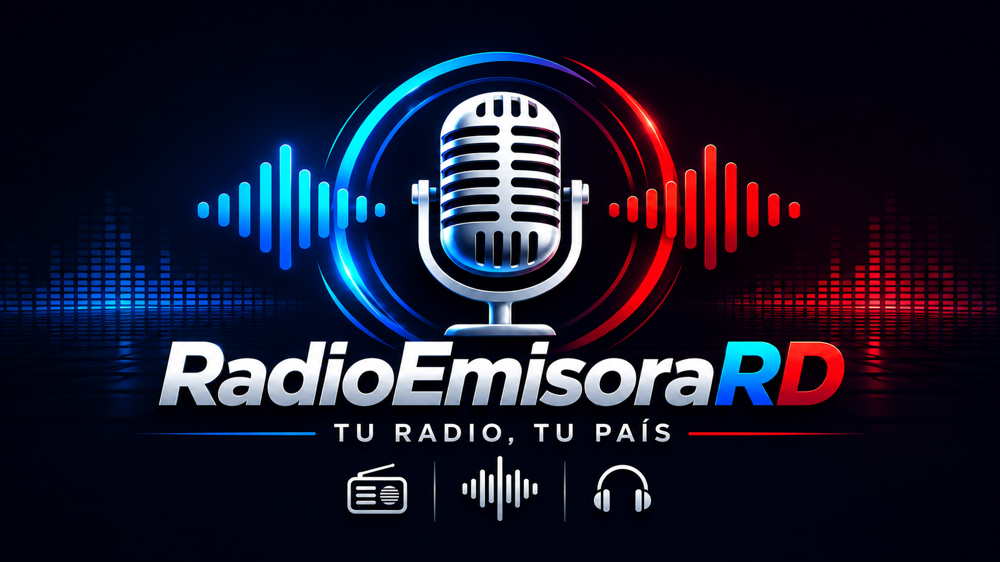
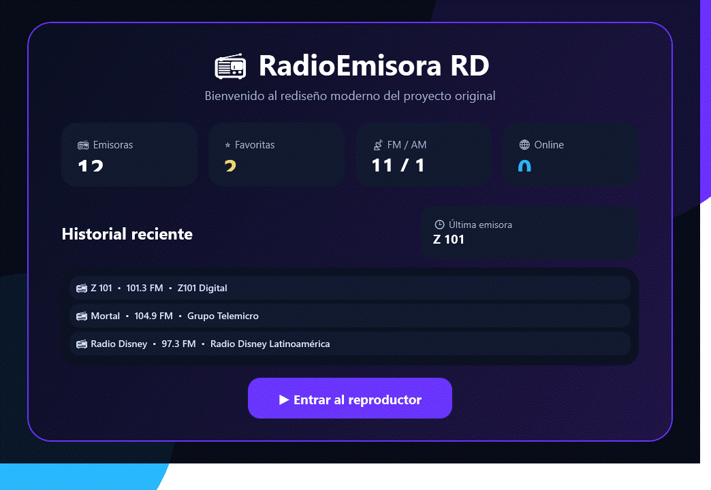
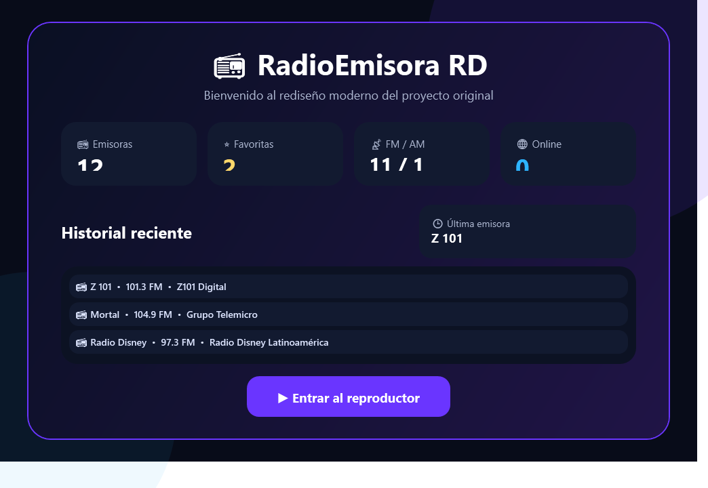
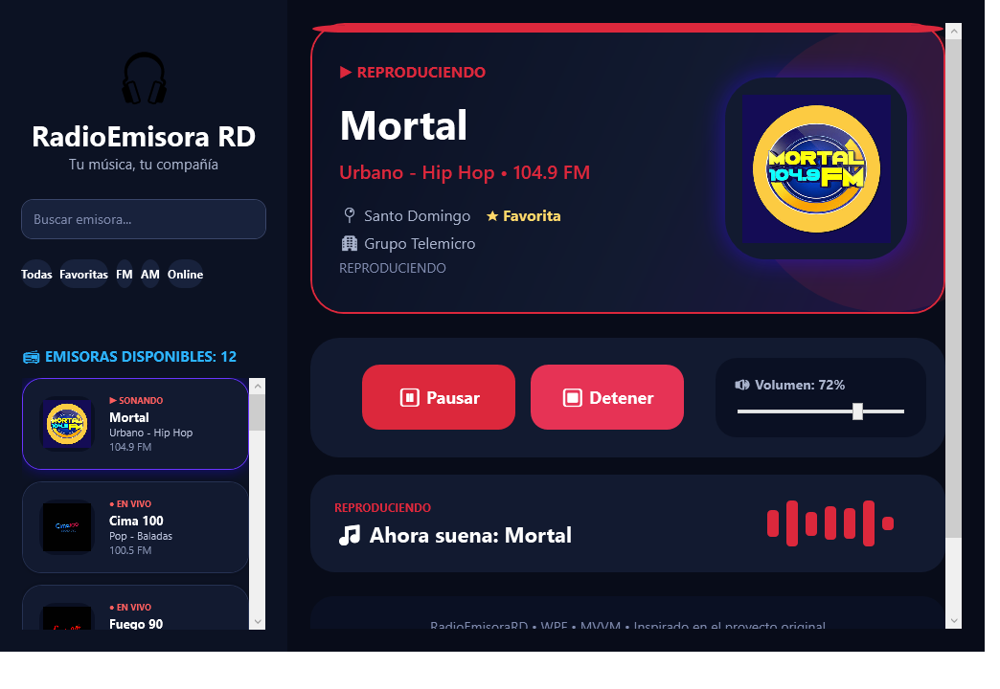
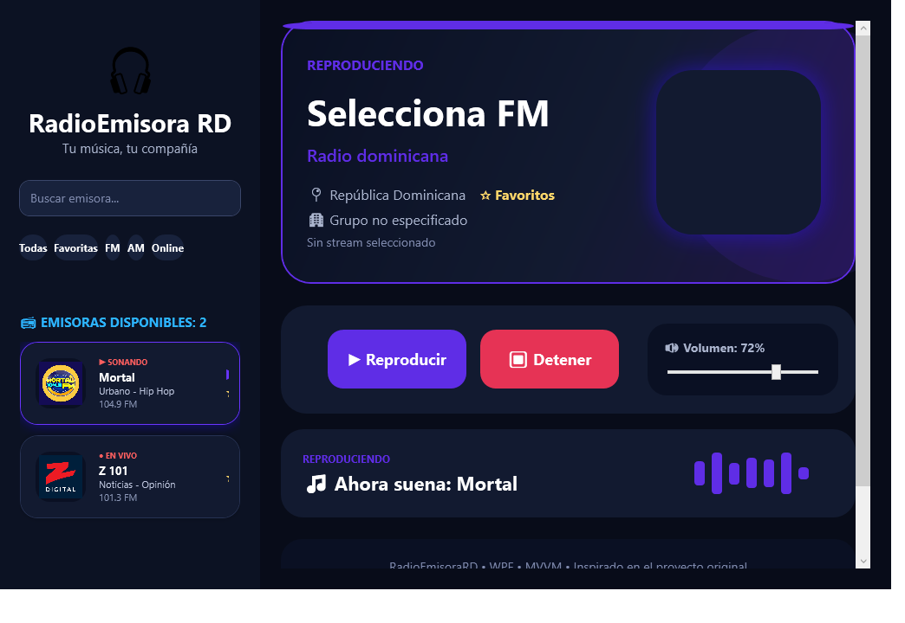
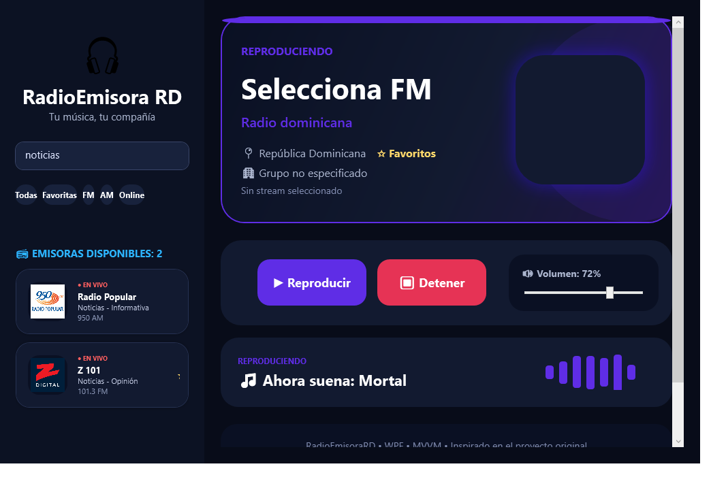
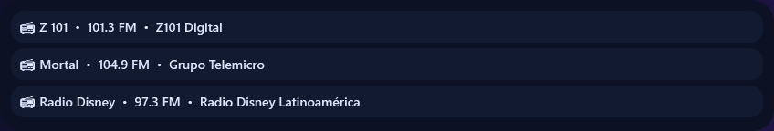
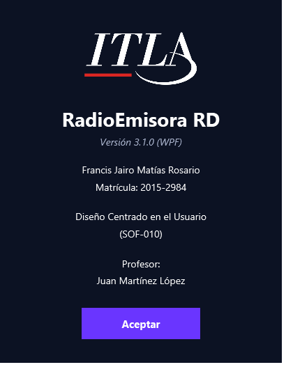
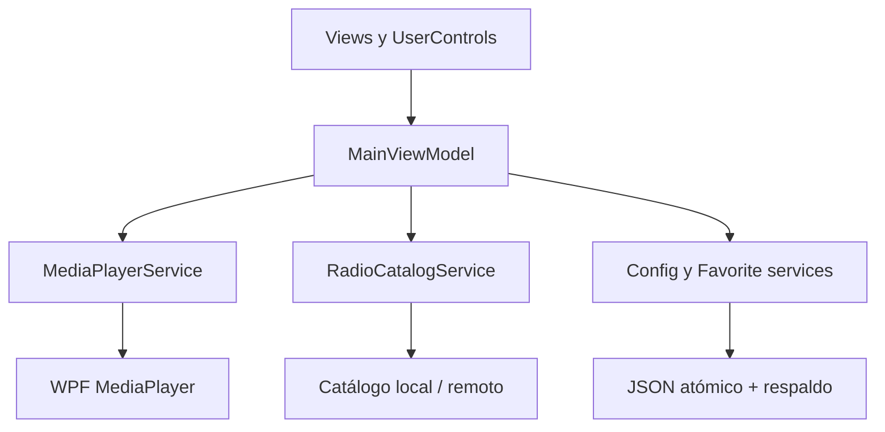

<p align="center">
  
</p>

<p align="center">
  Aplicación de escritorio para escuchar emisoras dominicanas mediante streaming en vivo.
</p>

<p align="center">
  
</p>

<p align="center">
  <a href="https://github.com/Jairo0811/RadioEmisora/actions/workflows/ci.yml"></a>
  <a href="https://github.com/Jairo0811/RadioEmisora/releases"></a>
  
  
  
  
</p>

<p align="center">
  <strong>WPF · C# · .NET 10 · XAML · MVVM · Streaming en vivo · JSON · MSTest · GitHub Actions</strong>
</p>

> ⭐ Modernización profesional del proyecto final de **Diseño Centrado en el Usuario (SOF-010)**, desarrollado originalmente en el ITLA durante el período **2018-C1**.

## 🎬 Demostración

<p align="center">
  
</p>

| 🏠 Dashboard | ▶️ Reproductor |
|---|---|
|  |  |

| ⭐ Favoritos | 🔎 Búsqueda |
|---|---|
|  |  |

| 🕘 Historial | ℹ️ Acerca de |
|---|---|
|  |  |

Las imágenes se generan desde la aplicación WPF real mediante el flujo de integración continua; no son mockups.

## 📖 Descripción

RadioEmisora RD permite explorar, buscar y escuchar un catálogo de emisoras mediante transmisión en línea. 

La versión 3.1 conserva el concepto, la navegación y la identidad visual de la reconstrucción WPF 3.0, y añade la capa final de estabilidad necesaria para presentarla en un portafolio profesional.

La aplicación funciona sin cuentas, base de datos ni servicios en la nube. Favoritos, historial, volumen, última emisora y configuración se almacenan localmente en JSON.

## ✨ Funcionalidades

### 📻 Reproducción robusta

- Reproducir, pausar, continuar y detener.
- Cambio rápido de emisora sin reproducciones simultáneas.
- Validación asíncrona del stream antes de abrir `MediaPlayer`.
- Timeout configurable sin bloquear la interfaz.
- Reconexión automática después de fallos temporales o pérdida de Internet.
- Cancelación segura de conexiones anteriores.
- Liberación explícita de eventos, streams, clientes HTTP, timers y `MediaPlayer`.
- Mensaje amigable y opción de reintentar cuando una emisora no está disponible.

### 🚦 Estados visibles

El reproductor refleja siete estados consistentes en el hero, el panel de reproducción y las tarjetas:

| Estado | Significado |
|---|---|
| ⏹️ Detenido | No hay reproducción activa |
| 🔄 Conectando | Se está comprobando el endpoint |
| ⏳ Buffering | El motor prepara el audio |
| ▶️ Reproduciendo | El stream está sonando |
| ⏸️ Pausado | La reproducción está suspendida |
| ♻️ Reconectando | Se intenta recuperar una conexión perdida |
| ❌ Error | El stream falló y puede reintentarse |

### 🗂️ Organización y persistencia

- Búsqueda en tiempo real sin distinción de mayúsculas ni acentos.
- Filtros: Todas, Favoritas, FM, AM y Online.
- Favoritos persistentes.
- Historial de las diez emisoras más recientes.
- Restauración de la última emisora seleccionada.
- Volumen persistente con escritura diferida para evitar acceso excesivo al disco.
- Guardado atómico, copia de respaldo y recuperación automática de JSON corrupto.

### 🌐 Catálogo actualizable

El catálogo base vive en [`catalog/emisoras.json`](catalog/emisoras.json). Al iniciar, la aplicación:

1. Carga siempre el catálogo incluido en la distribución.
2. Prefiere una copia local válida más reciente, si existe.
3. Consulta en segundo plano el JSON remoto alojado en GitHub.
4. Valida versión, identificadores, duplicados, logos, colores y URLs HTTPS.
5. Guarda la nueva versión de forma atómica.
6. Mantiene el catálogo local si no hay Internet, ocurre un timeout o el remoto es inválido.

La disponibilidad de un stream depende de su emisora o proveedor. Un fallo individual nunca bloquea el resto de la aplicación.

## 📻 Emisoras incluidas

| Emisora | Frecuencia | Categoría |
|---|---:|---|
| Mortal | 104.9 FM | Urbano / Hip Hop |
| Cima 100 | 100.5 FM | Pop / Baladas |
| Fuego 90 | 90.1 FM | Salsa / Merengue |
| Escándalo 102 | 102.5 FM | Tropical / Variada |
| Disco 106 | 106.1 FM | Pop / Disco |
| Radio Disney | 97.3 FM | Pop / Juvenil |
| Radio Popular | 950 AM | Noticias / Informativa |
| Z 101 | 101.3 FM | Noticias / Opinión |
| Primera FM | 88.1 FM | Variada |
| Alofoke FM | 99.3 FM | Urbano / Entretenimiento |
| Independencia FM | 93.3 FM | Urbano / Tropical |
| La Mega | 97.9 FM | Urbano / Tropical |

## 🧰 Stack tecnológico

### 🖥️ Aplicación de escritorio

<p>
  
</p>

- C#
- .NET 10
- WPF
- XAML
- Visual Studio 2022

### 🏗️ Arquitectura y experiencia de usuario

<p>
  
  
  
</p>

- Arquitectura MVVM.
- Data binding y comandos reutilizables.
- UserControls modulares.
- Temas y estilos compartidos.
- Navegación por teclado y diseño adaptable.

### 📡 Streaming y persistencia

<p>
  
  
</p>

- `System.Windows.Media.MediaPlayer`.
- Validación asíncrona de streams.
- Reconexión automática.
- Catálogo local y remoto.
- Persistencia JSON con respaldo y recuperación.

### 🧪 Calidad e infraestructura

<p>
  
</p>

- MSTest.
- GitHub Actions.
- Compilación con advertencias tratadas como errores.
- Publicación portable y autocontenida.
- Generación automatizada de capturas y artefactos.

## 🏗️ Arquitectura

La solución mantiene MVVM y separa la vista, el estado de presentación y la infraestructura:



### 📦 Responsabilidades

| Capa | Responsabilidad |
|---|---|
| Models | Emisoras, configuración, catálogo y estados |
| ViewModels | Comandos, navegación, filtros y estado observable |
| Services | Audio, red, catálogo, persistencia, historial y logging |
| Controls | Dashboard, hero, reproductor, sidebar, tarjetas y toast |
| Helpers | Comandos síncronos y asíncronos reutilizables |
| Themes | Colores, tarjetas, botones y foco de teclado |

### 📁 Estructura actual

```text
RadioEmisora/
├── .github/workflows/            # CI y publicación
├── catalog/emisoras.json         # Fuente versionada del catálogo
├── docs/                          # Logo, capturas y documentación
├── packaging/portable.flag       # Activador del modo portable
├── RadioEmisoraRD/
│   ├── RadioEmisoraRD/            # Aplicación WPF
│   │   ├── Assets/
│   │   ├── Controls/
│   │   ├── Helpers/
│   │   ├── Models/
│   │   ├── Properties/PublishProfiles/
│   │   ├── Services/
│   │   ├── Themes/
│   │   └── ViewModels/
│   ├── RadioEmisoraRD.Tests/      # Suite MSTest
│   └── RadioEmisoraRD.slnx
├── CHANGELOG.md
├── RELEASE_NOTES.md
└── README.md
```

Las versiones Windows Forms de 2018 y el prototipo intermedio permanecen documentados en el historial de Git, pero no forman parte del árbol activo de la versión 3.1.

## 📋 Requisitos

### ▶️ Para ejecutar

- Windows 10 versión 1809 o superior; Windows 11 recomendado.
- Conexión a Internet para escuchar emisoras.
- Build autocontenido: no requiere instalar .NET.
- Build portable dependiente del framework: Desktop Runtime de .NET 10.

### 🛠️ Para desarrollar

- Visual Studio 2022 actualizado con la carga de trabajo **Desarrollo de escritorio de .NET**.
- SDK de .NET 10.
- Git.

No existen paquetes de producción externos; la aplicación utiliza las bibliotecas de .NET y WPF. Las pruebas usan MSTest 4.3.3.

## 🚀 Instalación

### 📥 Descarga recomendada

1. Abre [Releases](https://github.com/Jairo0811/RadioEmisora/releases).
2. Descarga `RadioEmisoraRD-win-x64.zip`.
3. Comprueba el hash con `SHA256SUMS.txt` si deseas verificar la integridad.
4. Extrae el ZIP completo.
5. Ejecuta `RadioEmisoraRD.exe`.

Windows puede mostrar SmartScreen porque el ejecutable no está firmado digitalmente. Verifica que la descarga proceda de este repositorio y comprueba su SHA-256.

### 💻 Desde el código fuente

```powershell
git clone https://github.com/Jairo0811/RadioEmisora.git
cd RadioEmisora
dotnet restore .\RadioEmisoraRD\RadioEmisoraRD.slnx
dotnet run --project .\RadioEmisoraRD\RadioEmisoraRD\RadioEmisoraRD.csproj
```

## 🧪 Compilación, pruebas y publicación

```powershell
# Compilar sin advertencias
dotnet build .\RadioEmisoraRD\RadioEmisoraRD.slnx -c Release --warnaserror

# Ejecutar toda la suite
dotnet test .\RadioEmisoraRD\RadioEmisoraRD.slnx -c Release

# Publicación portable (requiere .NET 10 Desktop Runtime)
dotnet publish .\RadioEmisoraRD\RadioEmisoraRD\RadioEmisoraRD.csproj `
  -c Release -p:PublishProfile=Portable

# Publicación autocontenida para Windows x64
dotnet publish .\RadioEmisoraRD\RadioEmisoraRD\RadioEmisoraRD.csproj `
  -c Release -p:PublishProfile=SelfContained
```

La solución no publica MSIX porque un paquete instalable profesional requiere identidad de publicador y certificado de firma. El flujo de release genera ZIP portable y autocontenido con hashes SHA-256.

## ✅ Pruebas

La suite cubre:

- Configuración y normalización de valores.
- Recuperación de JSON corrupto.
- Guardado y deduplicación de favoritos.
- Orden y capacidad del historial.
- Búsqueda y filtros.
- Validación y fallback del catálogo.
- Rechazo de destinos locales/privados y URLs inseguras.
- Límite real del catálogo, incluso con respuestas comprimidas o sin `Content-Length`.
- Actualización remota por versión.
- Máquina de estados del reproductor.
- Conexión, reintentos, error, pausa, continuación y cierre.

GitHub Actions compila en `windows-latest`, trata advertencias como errores, ejecuta la suite, publica un build portable y genera las capturas reales del README.

## 🔐 Datos locales y privacidad

Modo normal:

```text
%APPDATA%\RadioEmisoraRD\
├── config.json
├── config.json.bak
├── favoritos.json
├── favoritos.json.bak
├── catalogo.json
└── Logs\radioemisorard-AAAAmmdd.log
```

Para modo portable, coloca `portable.flag` junto al ejecutable o define `RADIOEMISORARD_PORTABLE=1`. Los datos se guardarán en `Data` dentro de la carpeta de la aplicación.

RadioEmisora RD no crea cuentas, no recopila telemetría y no envía favoritos ni historial a servidores externos. Solo consulta el catálogo configurado y los endpoints de audio elegidos por el usuario.

Las conexiones salientes exigen HTTPS, no siguen redirecciones y bloquean direcciones loopback, privadas, link-local y nombres locales. Los catálogos y archivos JSON tienen límites de tamaño/profundidad; los textos, identificadores y rutas de logos se validan antes de mostrarse o persistirse. Los logs rotan al alcanzar 5 MB.

Como aplicación de escritorio local no expone rutas API ni un servicio multiusuario: no existe una frontera de autenticación HTTP que configurar. La autorización efectiva es la sesión de Windows y los permisos de la carpeta de datos.

## ⌨️ Atajos de teclado

| Atajo | Acción |
|---|---|
| `Enter` | Reproducir la emisora seleccionada |
| Doble clic | Reproducir una emisora |
| `Espacio` | Reproducir, pausar o continuar fuera de controles editables |
| `Esc` | Detener |
| `Ctrl + F` | Enfocar el buscador |
| `Ctrl + R` | Consultar el catálogo remoto |
| `Ctrl + Q` | Cerrar la aplicación |

## 🧰 Solución de problemas

| Problema | Acción recomendada |
|---|---|
| Una emisora no reproduce | Espera la reconexión automática y pulsa **Reintentar**. El resto del catálogo sigue disponible. |
| Todas las emisoras fallan | Verifica Internet, firewall, proxy corporativo y fecha/hora de Windows. |
| El catálogo no se actualiza | La aplicación usa automáticamente la copia local; prueba `Ctrl + R` más tarde. |
| Favoritos o volumen no se guardan | Comprueba permisos de `%APPDATA%\RadioEmisoraRD` o utiliza modo portable en una carpeta con escritura. |
| JSON corrupto | La aplicación preserva el archivo como `*.corrupt-fecha.json` y recupera el respaldo. |
| SmartScreen bloquea el EXE | Descarga desde Releases, valida SHA-256 y usa **Más información → Ejecutar de todas formas** solo si coincide. |
| Se repite un error | Revisa el log diario en la carpeta `Logs`. |

Consulta la [guía completa de troubleshooting](docs/TROUBLESHOOTING.md) para diagnóstico avanzado.

## 📈 Evolución

| Versión | Tecnología | Alcance |
|---|---|---|
| 2018 | Windows Forms, .NET Framework, ActiveX WMP | Proyecto final original |
| 2.0 | Windows Forms modernizado | Prototipo de recuperación |
| 3.0 | WPF, .NET 10, MVVM | Reconstrucción funcional |
| 3.1 | WPF, MVVM, pruebas, CI y streaming resiliente | Estabilización final para portafolio |

Consulta el [changelog](CHANGELOG.md) y las [notas de la versión 3.1.0](RELEASE_NOTES.md).

## 🎓 Información académica

| Información | Detalle |
|---|---|
| 👨‍🎓 Estudiante | Francis Jairo Matías Rosario |
| 🆔 Matrícula | 2015-2984 |
| 📖 Asignatura | Diseño Centrado en el Usuario (SOF-010) |
| 👨‍🏫 Profesor | Juan Martínez López |
| 🏫 Institución | Instituto Tecnológico de Las Américas (ITLA) |
| 📅 Período | 2018-C1 |
| 📁 Tipo | Proyecto final |
| 🛠️ Modernización | 2026 |

## 🔄 Continuidad académica

**RadioEmisora RD** representa el primer capítulo de una continuidad académica desarrollada con el profesor **Juan Martínez López** en el Instituto Tecnológico de Las Américas (ITLA). La relación entre los proyectos es académica y formativa: no comparten dominio funcional ni código, sino que documentan la evolución entre dos asignaturas impartidas por el mismo docente y sus respectivos proyectos finales.

La secuencia comenzó en **2018-C1** con **RadioEmisora**, proyecto final de **Diseño Centrado en el Usuario (SOF-010)**. Su enfoque principal estuvo en la experiencia de usuario, la interacción y el diseño de una aplicación de escritorio orientada al consumo de radio por Internet. La reconstrucción moderna **RadioEmisora RD** conserva ese origen y lo lleva a una implementación WPF contemporánea.

Dos cuatrimestres después, en **2018-C3**, la continuidad avanzó con **GestorAdministrativo**, proyecto final de **Administración de Proyectos de Software (SOF-013)**. El nuevo trabajo amplió la perspectiva desde el diseño de interacción hacia la planificación, organización y gestión integral de procesos de software. Ese proyecto académico fue posteriormente reconstruido y modernizado como [**AdminGest**](https://github.com/Jairo0811/AdminGest).

| Orden | Proyecto actual | Proyecto académico original | Asignatura | Profesor | Período |
|---:|---|---|---|---|---|
| 1 | **RadioEmisora RD** | RadioEmisora | Diseño Centrado en el Usuario (SOF-010) | Juan Martínez López | 2018-C1 |
| 2 | [**AdminGest**](https://github.com/Jairo0811/AdminGest) | GestorAdministrativo | Administración de Proyectos de Software (SOF-013) | Juan Martínez López | 2018-C3 |

Vista como trayectoria académica, esta secuencia muestra una progresión desde el **diseño centrado en las personas y la experiencia de usuario** hacia la **gestión de proyectos y procesos de software**. Las modernizaciones de 2026 preservan esa historia y, al mismo tiempo, incorporan arquitectura, pruebas, seguridad y prácticas de ingeniería actuales para convertir ambos trabajos en proyectos profesionales de portafolio.

## 👨‍💻 Autor

**Francis Jairo Matías Rosario — Jairo Matías**

- 🎓 Tecnólogo en Desarrollo de Software — ITLA.
- 🎓 Estudiante de Ingeniería de Software — UNAPEC.

## 📡 Aviso sobre streams

Los nombres, logos y transmisiones pertenecen a sus respectivas emisoras y proveedores. Este repositorio no aloja audio ni garantiza la disponibilidad permanente de endpoints externos. El catálogo puede actualizarse sin distribuir una nueva versión de la aplicación.
