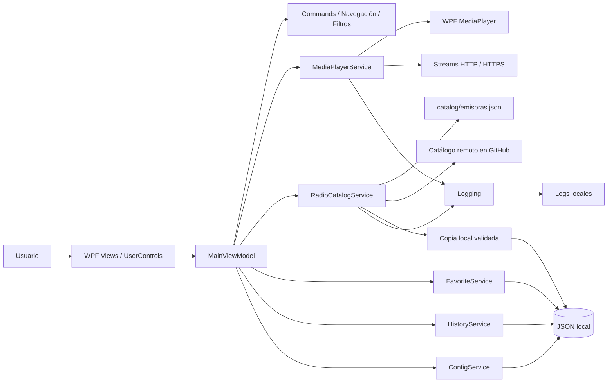
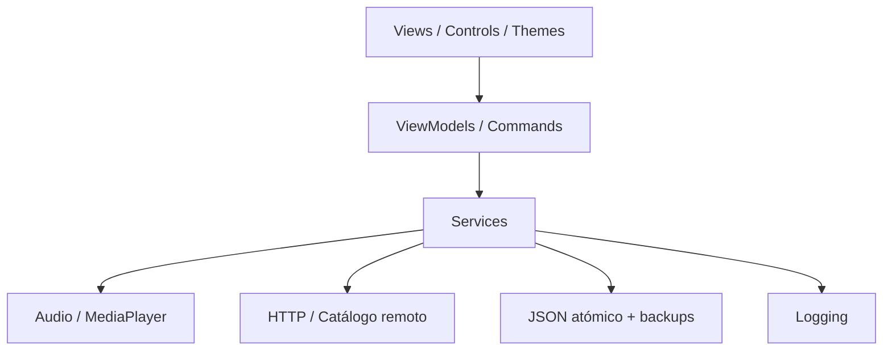
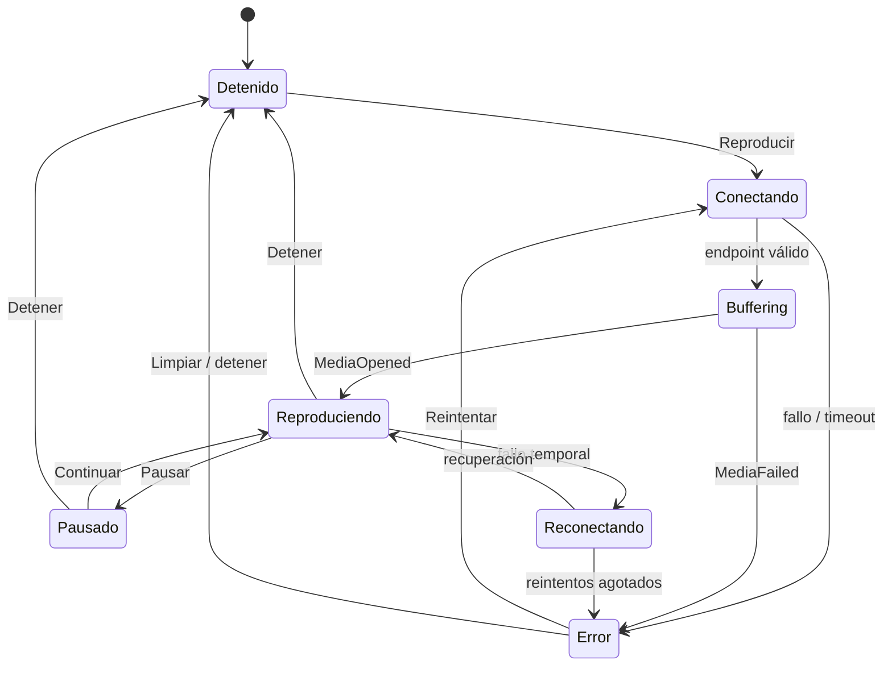
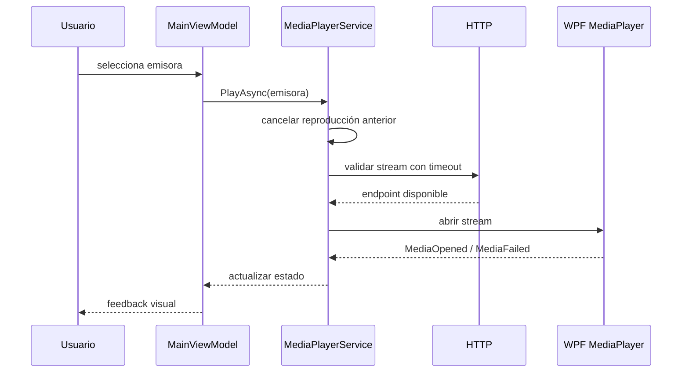
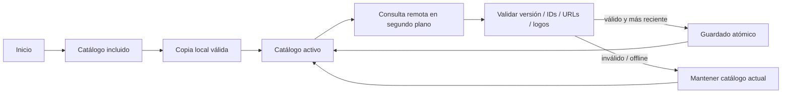
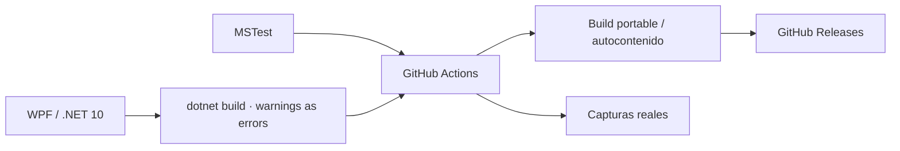

# Arquitectura de RadioEmisora RD

RadioEmisora RD utiliza **WPF + MVVM** sobre .NET 10. La aplicación separa presentación, estado de interfaz, reproducción, catálogo, persistencia y conectividad para mantener una experiencia de escritorio estable aun cuando un stream o el catálogo remoto fallen.

## Vista general



La interfaz no conoce detalles de HTTP, archivos o `MediaPlayer`. `MainViewModel` coordina estado y comandos, mientras los servicios encapsulan infraestructura y efectos secundarios.

## Capas y responsabilidades



| Área | Responsabilidad |
|---|---|
| Views / Controls | Presentación, layout, accesibilidad y bindings |
| ViewModels | Estado observable, navegación, búsqueda, filtros y comandos |
| Services | Audio, red, catálogo, persistencia, historial y logging |
| Models | Emisoras, configuración, catálogo y estados |
| Helpers | Comandos síncronos/asíncronos y utilidades reutilizables |
| Themes | Colores, estilos, tarjetas, botones y foco de teclado |

## Máquina de estados del reproductor



## Cambio de emisora



La cancelación de conexiones anteriores evita reproducciones simultáneas y condiciones de carrera durante cambios rápidos de emisora.

## Catálogo actualizable



## Persistencia local

La aplicación utiliza archivos JSON por usuario para configuración, favoritos, historial y catálogo actualizado. Las escrituras críticas se realizan de forma atómica y mantienen respaldo para recuperación ante corrupción.

```text
%APPDATA%/RadioEmisoraRD/
├── config.json
├── config.json.bak
├── favoritos.json
├── favoritos.json.bak
├── catalogo.json
└── Logs/
```

El modo portable redirige esta persistencia a una carpeta `Data` junto a la aplicación.

## Build y calidad



## Criterio de evolución

La arquitectura MVVM actual es suficiente para una aplicación de escritorio de un solo proceso. Nuevas capacidades deben añadirse como servicios y contratos antes de introducir dependencias directamente en los ViewModels o controles.
